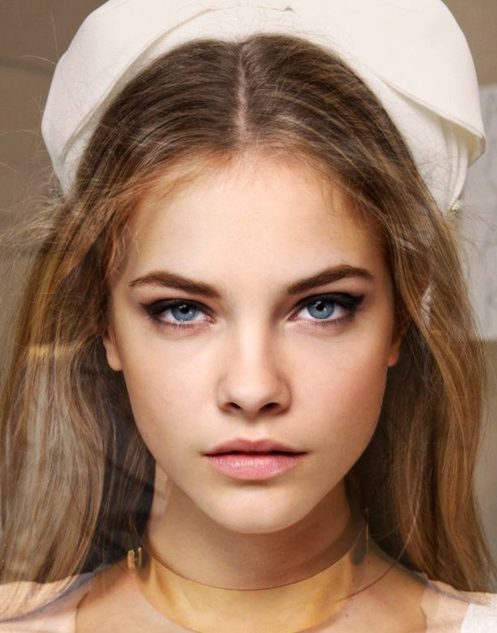
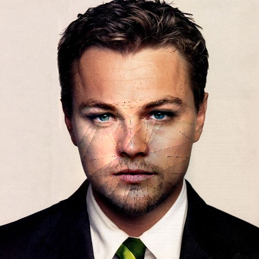

# CV-SWAP-APP


# Face Swap Application with Python & OpenCV

A Flask-based application that allows users to swap faces between two images. Utilizing the `shape_predictor_68_face_landmarks` model, the application identifies 68 facial landmarks to facilitate accurate face swapping.


## Sample Images

### Source and Destination Images



### Resultant Image


The application identifies landmarks, forms triangles, and swaps faces from the source to the destination image. It also adjusts for face orientation, color contrast, and image size.

## Process Overview

1. Input two images: source and destination.
2. Detect facial landmarks using dlib.
3. Form triangles by connecting the landmarks.
4. Extract the triangles.
5. Create a mask using the triangles.
6. Replace the source image mask with the destination image.
7. Smooth the swapped face for a natural look.

## Setup Instructions

1. Create a new conda environment:
```python
conda create -p venv python=3.7 -y
```
2. Activate conda environment
```python
conda activate venv/
```
3. Install requirements
```python
pip install -r requirements.txt
```
4. Run the web app
```python
python app.py
```
5. Access application
```python
http://localhost:5000/
```

## Potential Industrial Applications 
1. Add effects to the photos
2. Instagram and Snapchat filters
